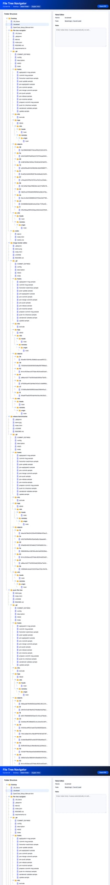
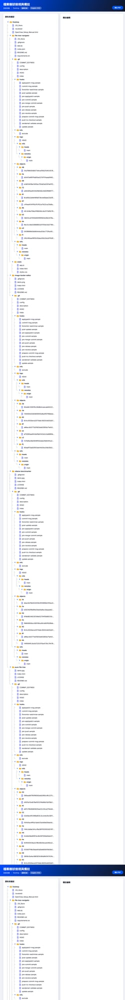

# Pure File Tree Navigator

A lightweight, pure web-based file tree explorer with annotation capabilities and PDF reporting.

---

### 🌐 Key Features (English)
- **100% Pure Web**: Zero installation. Runs directly in your browser using local file APIs.
- **Durable Annotations**: Add notes to files/folders; saves automatically to your browser's local storage.
- **i18n Support**: Seamless toggle between **English** and **Traditional Chinese**.
- **Professional PDF Export**: 
    - Generates high-quality reports matching a professional engineering look.
    - **SVG Tree Lines**: Structural lines remain visible even if "Print Background Graphics" is disabled.
    - **Searchable Text**: Real text output, not an image; allows copying and searching within the PDF.
    - **Smart Tags**: Automatic color-coded tags for common file types (DIR, IMG, DOC, ZIP).
- **Privacy First**: Files are processed locally; no data is ever uploaded to a server.

---

### 🌐 核心功能 (繁體中文)
- **100% 純網頁運作**：無需安裝。直接透過瀏覽器存取本地目錄，隨開即用。
- **持久化備註**：可為檔案或資料夾添加註解，系統會自動儲存於瀏覽器的本地儲存空間 (Local Storage)。
- **中英文雙語切換**：支援 **繁體中文** 與 **英文** 介面即時切換。
- **專業級 PDF 輸出**：
    - 產出對齊專業工程風格的結構報告。
    - **SVG 實體連線**：左側樹狀結構線條採用實體 SVG 繪製，即使不勾選「列印背景圖形」也能清晰顯示。
    - **真文字 PDF**：輸出內容為真實文字而非圖片，支援內容複製與全文搜尋。
    - **自動化標籤**：根據副檔名自動產生彩色分類標籤（如 DIR, IMG, DOC, ZIP）。
- **隱私安全**：所有操作均在本地端完成，絕不將檔案資訊上傳至雲端。

---

### 🖼️ Screenshots / 程式截圖

#### English Interface

#### 繁體中文介面

---

### 📄 License
This project is licensed under the MIT License.
EOF
